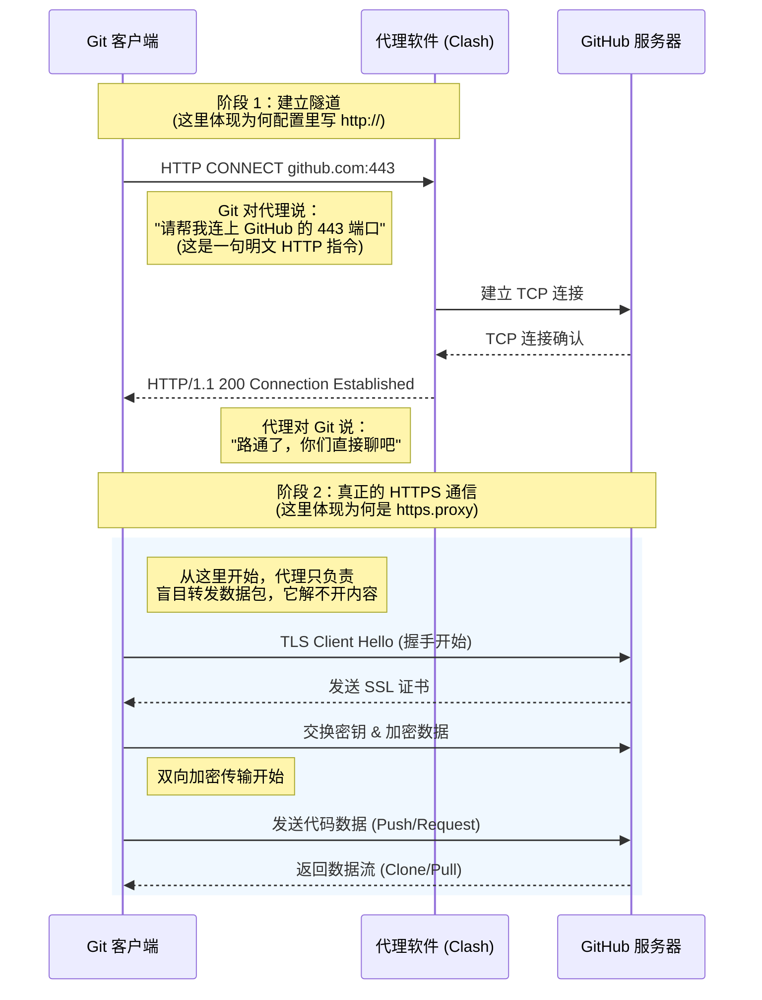

## 现象描述：   
- Failed to connect to github.com port 443 after 21100 ms: Could not connect to server。
- 可以ping通github，浏览器也可以访问github官网，但是git访问不了。  
```bash
(GPTSoVits) PS D:\Gen24\Projects> git clone https://github.com/RVC-Boss/GPT-SoVITS.git
Cloning into 'GPT-SoVITS'...
fatal: unable to access 'https://github.com/RVC-Boss/GPT-SoVITS.git/': Failed to connect to github.com port 443 after 21100 ms: Could not connect to server
```
**结论**：浏览器设置了代理，但 Git 没有，所以我们要为 Git 配上本地代理。

## 解决方法：
**step1**: 查看git有没有配置过代理   
```bash
# 查看全局 HTTP 代理 \
git config --global --get http.proxy 
# 查看全局 HTTPS 代理 
git config --global --get https.proxy
```
如果没有输出，则没有给git配置过代理。    

**step2**: 查看当前代理软件的代理地址、端口和代理方式，例如clash verge：     


**step3**: 上图可看出使用的混合代理，给 Git 配置时一般推荐先用 **HTTP 写法**，兼容性最好：
```bash
# 端口号自行替换
git config --global http.proxy  http://127.0.0.1:7897
git config --global https.proxy http://127.0.0.1:7897
```
配置好后可以尝试重新clone项目。

~~取消（清除）配置过的代理：~~
```bash
git config --global --unset http.proxy
git config --global --unset https.proxy
git config --global --get http.proxy # 查看是否清空
git config --global --get https.proxy
```

## 问题总结：



`git clone https://github.com/...` 时，实际上有两层东西：
1. **目标站的协议**：
    - 这里是 `https://github.com` —— 也就是 **GitHub 用 HTTPS 提供服务**。
2. **git软件到代理之间的协议**：
    - 这是 `http://127.0.0.1:7897` 或 `socks5://127.0.0.1:7897` —— 也就是 **你和 Clash 之间怎么说话**。

```bash
git config --global http.proxy  http://127.0.0.1:7897
git config --global https.proxy http://127.0.0.1:7897
```
意思是：   
访问 http://xxx 仓库 → 用 127.0.0.1:7897 这个 HTTP 代理
访问 https://xxx 仓库 → 也用 127.0.0.1:7897 这个 HTTP 代理

**大多数国内用的代理软件（包括 Clash）对外暴露的是“HTTP 代理”或者“Mixed 端口”**
- 它听的是一个 **明文 HTTP 协议**（带 CONNECT 方法）的端口；
- 当你访问 HTTPS 站点时，流程大概是：
    1. Git → 用 **HTTP 协议** 向代理发：  
        `CONNECT github.com:443 HTTP/1.1`
    2. 代理同意：  
        `HTTP/1.1 200 Connection Established`
    3. **从这之后**，Git 在这个 TCP 隧道里发起 TLS 握手，和 `github.com:443` 建立 HTTPS 连接。
所以：
- 你到 **代理** 是 HTTP 协议（所以要写 `http://127.0.0.1:7897`）；
- 你到 **GitHub** 是 HTTPS 协议，这一层被“隧道”进去了。
