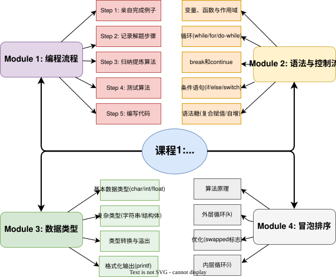

>**课程网站**：[https://www.coursera.org/specializations/c-programming](https://www.coursera.org/specializations/c-programming)

>mindmap
>


## Module 1: Introduction
- Programming: Plan First, Then Code  
- 
- 
- **Step 1: Work an Example Yourself**  
design an algorithm is to work at least one instance of the problem  
- **Step 2: Write Down What You Just Did**  
write down the steps to solve _that particular instance_  
- **Step 3: Generalize Your Steps**  
generalize those steps into an algorithm, and get the 'pseudo-code'  
- **Step 4: Test Your Algorithm**  
Whenever we detect problems with our algorithm in Step 4, we typically want to return to Steps 1 and 2 to get more information to generalize from. (it is fine to fix it right away without redoing Steps 1 and 2, if it is easy)  

>The reasons that novice programmers give for skipping straight to step 5 vary, but a common one is "Step 3 (writing a generalized algorithm) seemed too hard." This reason is quite possibly the _worst_ reason to skip over step 3—if making a correct plan is proving hard, how can you possibly hope to write correct code without the plan?
>As you become more and more practiced at this process, you may find that steps 1–4 come naturally, and you can do them in your head without writing them down—much like what happens with basic mathematical skills.

## Module 2: Reading Code
variables, declarations, assianments, operators:    
```C
// declare a variable
int myVariable; // variable's type variable's name ends with semicolon
myVariable = 3; // Assigning a Variable，lvalue = rvalue;
int x = 3; // Declarations and Assignments
```
Function：  
```C
// declare a function
int myFunction(int x, int y){ 
	int z = x - 2*y;
	return z * x; // function's return type is int
}

int main(void){
	int a;
	a = myFunction(3, 7);
	return 0;
}
```

In C, the scope of a local variable begins with its declaration and ends at the closing curly-brace (}), which closes the block of code—the code between matching open and close curly braces—that the variable was declared in.  


printf function  
```c
int main(void){
	int a = 42;
	int b = 7;
	printf("a is %d\n", a); // %d specifies that an integer should be formatted as a decimal number
	printf("b is %d, and a + b is %d\n", b, a+b);// \n is escape sequences 转义字符
	return 0;
}
```

**Conditional Statements**    
To write meaningful if/else statements, we need to introduce operators which allow us to compare two expressions and produce a Boolean outcome.  


- if/else statements  
```c
int f(int x, int y){
	if(x < y){
		printf("x < y\n");
		return y + x;
	}
	else{
		printf("x >= y\n");
		if(x > 8){  // if/else语句可以嵌套 may be nestd
			return y + 7;
		} // if/else语句可以没有else
	}
	return x - 2;
}

int main(void){
	int a = f(3, 4);
	int b = f(a, 5);
	return 0;
}
```

- switch/case  
Note that reaching another case label does not end the current case. Unless the execution arrow encounters break, execution continues from one statement to the next. When the execution arrow passes from one case into the next like this, it is called “falling through” into the next case.  
```c
int g(int n, int x){
	switch(x + n){
		case 8:
			x = x + 1;
		case 0:
			n = n - 1;
			break; // 除非遇到break，否则接着执行下一个case
		case 14:
			return n - x; // meet return 直接跳出函数
		default: // If no label matches, then just switchs to the default case if there is one
			x = n;
			break;
	}
	return x * n;
}

int main(void){
	int a = g(10, 4);
	int b = g(a, 2);
	int c = g(9, b);
	return 0;
}
```

C (and many other programming languages) has shorthand—also called _syntactic sugar_—for a variety of common operations.  


**Loops for repetition**  
- While loops  
```c
int g(int a, int b){
	int total = 0;
	while(a < b){
		total += a;
		printf("a=%d, b=%d\n", a, b);
		a++;
		b--;
	}
	return total;
}

int main(void){
	int x = g(2, 9);
	printf("x=%d\n", x);
	return 0;
}
```

- do/while loops  
the do-while loop checks its conditional expression at the bottom of the loop—after it has executed the body.A while loop may execute its body zero times, skipping the entire loop, if the condition is false initially. By contrast, a **do-while loop is guaranteed to execute its body at least once** because it executes the loop body before ever checking the condition.
- for loops   
notice that there is a set of curly braces around the entire piece of while-based code.  


**Continue and Break**    
Sometimes a programmer wants to leave the loop body early, rather than finishing all of the statements in side of it.  
Whenever the execution arrow encounters a break statement, it executes the statement by jumping out of the innermost enclosing loop (whether it is a while, do-while, or for loop), or switch statement.  
Executing the continue statement jumps to the top of the innermost enclosing loop (if it is not in a loop, it is an error).*In the case of a for loop, the “increment statement” in the for loop is executed immediately before the jump.*  
```c
void printRemainders(int lo, int hi, int n){
	for(int i = lo; i < hi; i++){
		if(i == 0){
		printf("Cannot divide by 0.\n");
		continue; // 直接i++,然后开始下一轮for循环，
		}
		printf("%d mod %d = %d\n", n, i, n % i);
	}
}
int main(void){
	printRemainders(-2, 4, 5);
	return 0;
}
```

## Module 3: Types
A type is a programming language construct that specifies both a size and an interpretation of a series of bits stored in a computer.  


>The leading **0x** (interchangeable with just x) indicates that the number is in hex.  

**Binary Numbers**  
>“There are 10 types of people in the world. Those who understand binary and those who do not.”  


C supports a very small number of data types，there are the basic types.  


At first glance of the figure below, c and x appear identical since they both have the binary value 65. However, they differ in both **size** (c has only 8 bits whereas x has 32) and **interpretation** (c’s value is interpreted using ASCII encoding whereas x’s value is interpreted as an integer). Similarly, y and z are identical in hardware but have differing interpretations because y is unsigned and z is not.  


Specifically, all numbers with **the most significant bit equal to 1 are negative numbers**.  
A 32-bit int is inherently signed (i.e., can have both positive and negative values) and can express values from -2,147,483,648 to 2,147,483,647.  
Note that both **unsigned and signed ints** have 2^{32} possible values. For the unsigned int they are all positive; for the signed int, half are positive and half are negative.  

In **two's complement**, the process for negating a number may seem a bit weird, but actually makes a lot of sense when you understand why it is setup this way. To compute negative X, you take the bits for X, **flip them (turn 0s into 1s and 1s into 0s), and then add 1**. So if you had 4-bit binary and took the number 5 (0101) and wanted negative 5, you would first flip the bits (1010) and then add 1 (1011). Why would computer scientists pick such a strange rule? It turns out that this rule makes it so that you can just add numbers naturally and get the right result whether the numbers are positive or negative. For example -5 + 1 = -4, and in binary 1011 + 0001 is 1100. To see that 1100 is -4, flip the bits (0011) and add 1 (0100) which is 4.  

Computers use floating point notation, the same notation but implicitly in base 2: m\times 2^{e}.  


It is important for programmers to understand precision and the cost.  


various **format specifiers** for the function printf.  


```c
char letter = 'G';
int negNumber = -1;
unsigned int age = 33;
// 使用不匹配的格式说明符
printf("G is numeric value is %d\n", letter);
printf("-1 as hex is %x\n", negNumber);
printf("-1 as an unsigned is %u\n", negNumber);
printf("33 as a letter is %c\n", age);

////output:
//G's numeri cvalue is 71
//-1 as hex is ffffffff
//-1as an unsigned is 4294967295
//33 as a letter is！
```

**type conversion** or type promotion（类型转换，编译器自动处理）  
**Casting**（强制类型转换，手动设定）  

```c
int main(void) {
	int nHrs = 40;
	int nDays = 7;
	float avg = nHrs/nDays; 
	//integer division always produces an integer result—in this case 5
	//然后avg的float声明会把5自动转换成5.0
	float avg = nHrs/(float)nDays; //强制类型转换的优先级会更高，然后编译器会自动将hHrs也转成float型
	printf("%d hours in %d days\n", nHrs, nDays);
	printf("work %.1f hours per day!\n", avg);

}
```

**Overflow and Underflow**    
For example, a **short** is typically 16 bits, meaning it can express exactly 2^16 possible values. If these values are split between positive and negative numbers, then the largest possible number that can be stored in a short is 0111111111111111, or 32767. Adding 1 yields an unsurprising 1000000000000000. The bit pattern is expected. But the interpretation of a signed short with this bit pattern is -32768  

[](https://xkcd.com/571/)

_“Non-numbers", i.e., strings, images, sound and video, actually are numbers._  

**Strings**    
To truly understand how to create and use strings, an understanding of **pointers** is required.  


**Structs**    
A _struct_ allows a programmer to bundle multiple variables into a single entity.  


The figure below shows four different syntactic options that all create the same conceptual struct.  


**Typedef**  
typedefs can simplify the use of structs, also can help you make your code more readable, by *naming a type according to its meaning and use*. Use typedefs when the abstraction simplifies rather than obfuscates your code.  


==上图例子就是将 unsigned int 定义为 rgb_t。然后直接用rgb_t来定义函数或者变量的类型。==  

**enumerated type**    
```c
enum threat_level_t { // 定义一个枚举类型，每个级别都被赋予一个常量值，从 0 开始。
  LOW, // Their values cannot **change** throughout the program.
  GUARDED,
  ELEVATED,
  HIGH,
  SEVERE
}
  
void printThreat(enum threat_level_t threat){
	switch(threat) {
		case LOW:
			printf("Green/Low.\n"); 
			break;
		case GUARDED:
			printf("Blue/Guarded.\n"); 
			break;
		case ELEVATED:
			printf("Yellow/Elevated.\n"); 
			break;
		case HIGH:
			printf("Orange/High.\n"); 
			break;
		case SEVERE:
			printf("Red/Severe.\n");
			break;
	} 
}

void printShoes(enum threat_level_t currThreat) {
	if (currThreat >= ELEVATED) {
		printf("Please take off your shoes.\n”);
	}
	else {
		printf("Please leave your shoes on.\n”);
	}
}

int main(void) {
	enum threat_level_t myThreat = HIGH; //enum threat_level_t定义枚举变量，这里myThreat的值是3
	printf("Current threat level is:\n");
	printThreat(myThreat);
	printShoes(myThreat);
	return 0;
}
```

## Module 4: Project  
**sorting algorithm** (Bubble Sort)  
1. Let N = length of the input list (number of elements to sort).    
2. For k from 1 to N-1 (outer loop: controls sorting passes):    
    a. Initialize a flag `swapped = False` (tracks if any swaps happen in this pass).  
    b. Iterate i from 0 to N-k-1 (inner loop: compares adjacent elements, skips sorted tail):  
	    If list[i] > list[i+1] (out of order):  
			- Use a temp variable `t` to swap: set `t = list[i+1]`,    then `list[i+1] = list[i]`, finally `list[i] = t`.   
    - Set `swapped = True` (mark that a swap occurred).     
    c. (Optional Early Exit) If `swapped` remains `False` after the inner loop: break all loops (list is fully sorted).    
    
## 课程1心得感悟
课程安排非常好，reading的部分比较基础但是同样有一定的广度拓展，video的部分会举一些进阶的例子，同时验证了reading里随笔一提拓展知识，而不是单纯的重复强调。这种内容安排会一直源源不断地给我刺激，即使是第一课，主要就是概念和总体思路，但就是让人感觉学的停不下来。  

上次学C还是大一的时候，大都忘了，这次用英文材料学，对基本概念的理解更加通透一点了，尤其是字符类型、结构体、typedef，第一次学的时候理解有挺多障碍，现在好多了。

Course 1 was completed in six days.

[跳转->课程2学习笔记](./Introductory-C-Programming-Specialization-Course2.md)
