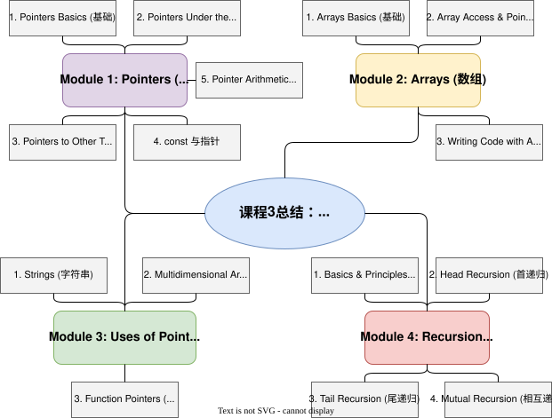

>course3 mindmap:
>

## Module 1: Pointers
### Pointer Basics
Pointers are way of referring to the _location_ of a variable. Instead of storing a value like 5 or the character 'c', *a pointer's value is the location of another variable*.    

**Declaring a pointer**     
In C, "pointer" (by itself) is not a type. It is a _type constructor_.    

`char * my_char_pointer;` declares a variable with the name **my_char_pointer** with the type _pointer to a char_ (a variable that points to a character).    
- the name of the variable(pointer):  `my_char_pointer`     
- and type of variable that this pointer will be pointing to: `char`   


Conceptually, the **&** operator (the symbol is called an "ampersand", and the operator is named the "address-of" operator) gives us an arrow pointing at its operand.   
The code **xPtr = &x;**_,_ for example, sets the value of the variable **xPtr** to the _address of_ **x**. After it is initialized, **xPtr** points to the variable **x**.    

It is important to note that the address of a variable is not itself an lvalue, and thus not something that can be changed by the programmer. The code **&x = 5;** will not compile. A programmer can access the location of a variable, but it is not possible to change the location of a variable.    

**Dereferencing a pointer**（解引用）    
`*xPtr = 6;` changes the value that xPtr points to (_i.e._, the value in the box at the end of the arrow—namely, x’s box)—to 6.

Do not be confused by the two contexts in which you will see the star (_*_) symbol.     
- In a variable declaration `int * xPtr`:   
	`int *` is the type of xPtr
- In an expression, the star is the dereference operator.
	`r = *p;` gives the variable _r_ a new value
	`*p = r;` changes the value inside the box that p points at to be a new value
	`int * q = &y;` is the same as the two statements `int *q;` `q = &y;`

**When working with pointers, _always draw pictures_.**      
The right-hand side (the _y_ in the statement _x = y_ ;) is called the _rvalue_. This is the value that will be placed inside the box/lvalue. With the introduction of pointers, we add two new types of expressions that can appear in rvalues: the address of an lvalue (_&x_), and dereferencing a pointer (_*p_).    


通过调用函数，交换两个指针（地址)指向的值，
```c
void swap(int *x, int *y) { //int * 声明x和y是保存地址的指针
  int temp = *x;
  *x = *y;
  *y = temp;
}
int main(void) {
  int a = 3;
  int b = 4;
  swap(&a, &b); //所以传入函数的参数是地址
  printf("a = %d, b = %d\n", a, b);
  return EXIT_SUCCESS;
}
```

### pointers under the hood

The figure above is hardware representation of the declaration and initialization of one 4-byte integer, four 1-byte characters, and finally two 4-byte pointers. **Each variable has a base address**.   

Consequently, lines like these are illegal: _int *ptr = &3_; and int _*ptr = &(x + y_);. **Note that _3_ and (_x+y_) are not lvalues**—they do not name boxes, which is why they cannot have an address  

On a 32-bit machine, addresses are 32 bits in size. Therefore **pointers are always 4 bytes in size**, regardless of the size of the data they point to.   


（右图为了画图方便，把4个字节“打包”进了一个红色的框里而已）

### pointers to other types

**Pointers to Structs**    

- `*a.b` : it means \*(a.b)—a should be a struct, which we look inside to find a field named _b_ (which should be a pointer), and we dereference that pointer.
- `*q.x` we would receive a compiler error, as _q_ is not a struct, and the order of operations would say to do _q.x_ first (which is not possible, since _q_ is not a struct).
- `q->x`: (which means exactly the same thing as `(*q).x`)
- For our more complex example, we could instead write` q->r->s->t` (which is easier to read and modify).

**Pointers to Pointers**    
For example, an `int *` is a pointer to a pointer to an int. An `int**` is a pointer to a pointer to a pointer to an int.  

If we were to write `* r`, it would refer to `q`’s box.     
we have four names for a’s box: `a`, `*p`, `**q`, and `***r`. Whenever we have more than one name for a box, we say that the names _alias_ each other—that is, we might say `*p` **aliases** `**q`.   

>“I wrote _x = 4_;, then look I don’t assign to _x_ anywhere in this code, but now it is 47!” Generally such behavior indicates that you alias the variable in question (although you may not have meant to).

```c
float f = 3.14;
int * p = (int *) &f;  // generally a bad idea!
printf("%d\n", *p); //prints _078523331 as output
// Here, f is an alias for *p, although f is declared to be a float
//floating point encoding of 3.14 works out to ( 0x4048F5C3 in hex, 1078523331 in decimal)

float f = 3.14; 
int x = (int) f; //cast a float to an int
printf("%d\n", x); 
```


**const** [course2笔记也有类似总结](Introductory-C-Programming-Specialization-Course2.md#了解下**指针**：)
```c
const int x = 3; // assigning to x is illegal

const int * p = &x; // declared p as a pointer to a const int
int const * p = &x; // same as const int * p
int * const p = &x; // p is a const pointer to a (modifiable) int
const int * const p = &x; // both is const


```

| Can we change **p           | Can we change *p | Can we change p |     |
| --------------------------- | ---------------- | --------------- | --- |
| int ** p                    | Yes              | Yes             | Yes |
| const int ** p              | No               | Yes             | Yes |
| int * const * p             | Yes              | No              | Yes |
| int ** const p              | Yes              | Yes             | No  |
| const int * const * p       | No               | No              | Yes |
| const int ** const p        | No               | Yes             | No  |
| int * const * const p       | Yes              | No              | No  |
| const int * const * const p | No               | No              | No  |

```c
int x = 3;
const int * p = &x;
x = 4;
//not allowed to change *p, 
// the value we find at *p can still be changed by assigning to x


const int y = 3;
int * q = &y; // this line is an error
*q = 4;
//assign &y (which has type const int *) to q (which has type int *)
//discarding the const qualifier (const is called a qualifier because it modifies a type).

```


**Pointer Arithmetic**   
Like all types in C, pointers are variables with numerical values.   
```c
int x = 4;
float y = 4.0;
int *ptr = &x;

x = x + 1;
y = y + 1;
ptr = ptr + 1;
```
For both integers and floating point numbers, adding 1 has the basic semantics of “**one larger**”. For the integer pointer ptr (which initially points to x), adding 1 has the semantics of “**one integer later** in memory”.    
(_e.g._, +1 means to change the numerical value of the pointer by +4). Likewise, when adding N to a pointer to any type T, the compiler generates instructions which add _(N * the number of bytes for values of type T)_ to the numeric value of the pointer—causing it to point N Ts further in memory.   

Incrementing the pointer will point it at _some_ location in memory, we just do not know what. It _could_ be the box for y, the return address of the function, or even the box for ptr itself.     
We will note that simply performing arithmetic on pointers such that they do not point to a valid box is not, by itself, an error—only dereferencing the pointer while we do not know what it points at is the problem.


**Memory Checker Tools**    
it is crucial to use memory checker tools, such as **valgrind** and/or the compiler option **-fsanitize=address**.   


**pointer to pointer e.g.  **    
```c test.c
#include <stdio.h>
#include <stdlib.h>

int f(int ** r, int ** s) {
  int temp = ** r;
  int temp2 = **s;
  int * z = *r;
  *r = *s;
  *s = z;
  printf("**r = %d\n",**r);
  printf("**s = %d\n",**s);
  *z += 3;
  **s -= 8;
  **r -= 19;
  return temp + temp2;
}

int main(void) {
  int a = 80;
  int b = 12;
  int * p = &a;
  int * q = &b;
  int x = f(&p, &q);
  printf("x = %d\n", x);
  printf("*p = %d\n", *p);
  printf("*q = %d\n", *q);
  printf("a = %d\n", a);
  printf("b = %d\n", b);
  return EXIT_SUCCESS;
}
```

对应的makefile文件
```Makefile 
# 1. 定义变量（可选，但更易维护） 
CC = gcc # 编译器 
CFLAGS = -std=gnu99 -pedantic -Wall # 编译选项（你的命令参数） 
TARGET = test # 目标文件名 
# 2. 主目标：最终要生成的可执行文件（test） 
# 依赖：test.o（编译生成的目标文件） 
$(TARGET): test.o 
	$(CC) $(CFLAGS) test.o -o $(TARGET) # 命令行（前面必须是 Tab 键！） 
# 3. 子目标：编译 .c 文件生成 .o 目标文件（可选，覆盖 make 隐式规则） 
# 依赖：test.c（源文件） 
test.o: test.c 
	$(CC) $(CFLAGS) -c test.c -o test.o # -c 表示只编译不链接 
# 4. 清理目标（可选，但非常实用） 
.PHONY: clean # 声明 clean 是伪目标，避免目录中有 clean 文件时失效 
clean: 
	rm -f $(TARGET) *.o # 删除可执行文件和所有 .o 目标文件
```

```makefile
# 简化写法
.PHONY: all clean 
all: # 默认目标，执行 make 直接编译 
	gcc test.c -std=gnu99 -pedantic -Wall -o test
clean: 
	rm -f test # 只需要删除可执行文件，没有 .o 要清理
```
`all` 被声明为伪目标，只影响 “是否检查文件”，不影响它 “作为第一个目标被默认执行” 的特性。  

## Module 2: Arrays
### Arrays Basics
An _array_ is a sequence of items of the same type.    
```c
int myArray[4]; // Array Declaration
// myArray just names a pointer to the first box in the array

int myArray[4] = {42, 39, 16, 7}; //declaration and initialization
int myArray[4] = {0}; // initialize all elements to 0
int myArray[] = {42, 39, 16, 7}; // compiler figures out [4]

point p = {3, 4}; //initialize structs
//initialize the first field of p to 3 and the second field to 4
point p = { .x = 3, .y = 4};
point myPoints[] = { {.x = 3, .y = 4},
                     {.x = 5, .y = 7},
                     {.x = 9, .y = 2} }; //声明并初始化结构体数组
```

**Accessing an Array**     
It is important to note that in C (and C++ and Java), array indexes are __zero-based__ — the first element of the array is _myArray_[0].

>**pointer arithmetic** and **array indexing** are exactly the same under the hood, the compiler **turns _myArray_[i] into \*(myArray + i)** (This definition leads to a “stupid C trick” that you can use to perplex your friends: _i_[myArray] looks ridiculous, but is perfectly legal. Why? _i_[myArray] = \*(_i + myArray_). Since addition is commutative, that is the same as \*(_myArray + i_), which is the same as _myArray_[i].    
>if we take `&myArray[i]`, it is equivalent to `&*(myArray +i)`, and the & and * cancel (as we learned previously, they are inverse operators), so it is just **myArray + i**. This result is fortunate, as it lines up with what we would hope for: &myArray[i] says “give me an arrow pointing at the _ith_ box of _myArray_” while _myArray + i_ says “give me a pointer i boxes after where _myArray_ points”—these are two different ways to describe the same thing.    
>在编程语言（如 C/C++）中，数组越界访问属于未定义行为（Undefined Behavior）：1. 语言标准未规定越界访问的结果，程序行为完全不可控。

**`data`(Array) is not a lvalue, just names a pointer to the first box in the array:**  
Array Access with Pointer Arithmetic：

Array Access with Pointer Indexing：


### Writing code with Arrays

**Passing Arrays as Parameters**    
In general, when we want to pass an array as a parameter, we will want to pass a pointer to the array, as well as an integer specifying how many elements are in the array.     
**There is no way to get the size of an array in C, other than passing along that information explicitly**, and we often want to make functions which are generic in the size of the array they can operate on (_i.e._, we do not want to hardcode a function to only work on an array of a particular size). If we wanted, we could make a struct which puts the array and its size together, as one piece of data—then pass that struct around.
```c
int myFunction(int * myArray, int size) {
  // we can index myArray like an array
}

int myFunction(int myArray[], int size) {
  // whatever code...
}
```


**find Index of Largest Element:  ** 
```C
int findLargestIndex(int * array, int n){
	//lf n is less than or equal to O, give an answer of -1
	if(n<=0）{
		return -1;
	}
	int largestIndex = 0;
	for (int i=1;i< n;i++){
		if (array[i] > array[largestIndex]){
			ilargestIndex = i;
		}
	}
	return largestIndex;
}
```

**find closest point using array:**


**Dangling Pointers**    
Whenever you have a pointer to something whose memory has been deallocated, it is called a _dangling pointer_. Dereferencing a dangling pointer results in undefined behavior (and thus represents a serious problem with your code) because you have no idea what values are at the end of the arrow.


**Array size**    
>In C, the number of bits we would need varies from one platform to another—on a 32-bit platform (meaning memory addresses are 32 bits), we would want a 32-bit unsigned int; on a 64-bit platform we would want a 64 bit unsigned int.

“unsigned integers that describe the size of things”—`size_t`. Whenever you see **size_t**, you should think “unsigned int with the right number of bits to describe the size or index of an array.”

```c
point * closestPoint (point * s, size_t n, point p) {
  if (n == 0) {
    return NULL;
  }
  double bestDistance = computeDistance(s[0],p);
  point * bestChoice = &s[0];
  for (size_t i = 1; i < n ; i++) {
    double currentDistance = computeDistance(s[i],p);
    if (currentDistance < bestDistance) {
      bestChoice = &s[i];
      bestDistance = currentDistance;
    }
  }
  return bestChoice;
}
```

calculate the size of a type for you with the **sizeof** operator    
The **sizeof** operator takes one operand, which can either be a type name (_e.g._, `sizeof(double)`) or an expression (_e.g._, `sizeof(*p)`)


## Module 3: Uses of Pointers
### Strings

**String Literals**     

Note that string literals are typically placed in a **read-only** portion of the static data section, as seen above.   
```c
const char * str = "Hello World\n";
//a pointer to characters which cannot be modified

char * str1 = "Hello";
str1[0] = 'J';  // this would crash, but suppose it did not

char * str2 = "Hello";
printf("%s\n", str2);
// str1 and str2 could point at the same memory

```

**Mutable Strings**     
```c
char str[] = "Hello World\n";
//This code behaves exactly as if we wrote:
char str[] = {'H', 'e', 'l', 'l', 'o', ' ',
              'W', 'o', 'r', 'l'  'd', '\n', '\0'};
//That is, it declares a variable str which is an array of 13 characters

char str[12] = "Hello World\n"; //there will be no '\0' placed at the end
```
if `\0` is not placed at the end. The compiler allows this behavior since it makes for a perfectly valid array of characters, even though it is not a valid _string_.     


**String Equality**   

If we write _str1 == str2_, it will check if _str1_ and _str2_ are arrows **pointing at the same place**.Sometimes pointer equality is what we mean, but more often, we want to check to see if the two strings have the same sequence of characters, even if they are in different locations in memory.   

```c
int stringEqual(const char * strl, const char * str2) {
	const char * pl = strl;
	const char * p2= str2;
	//As long as what p1 points at is the same as what p2 points at
	while（*pl==*p2）{
		if （*pl =='\0'）{
		return 1;
		}
		p1++;
		p2++;
	}
	return 0;
```

This task is common enough that there is already a function to do it—called `strcmp`—in _string.h_ of the C library.——it returns 0 if the strings are equal, and non-zero if they are different.

**String Copying**    

We may, however, want to actually copy the contents of the string from one location to another. As with comparing for equality, doing this copy yourself requires **iterating** through the characters of the string and copying them one by one to the destination. In doing so, we must be careful that the destination has sufficient space to receive the string being copied into it.   

The C library has a function, `strncpy` which performs this task for us—it copies a string from one location to another, and takes a parameter (_n_) telling it the maximum number of characters it is allowed to copy.

**Converting Strings to ints**    
```c
const char * str = "12345";
int x = str; //error，makes integer from pointer without a cast
//it would take the numerical value of str and assign it to x
```


If assign `x = str`, we would copy the **value** from _str_ (which is 0x100000f40) into _x_. Of course, since _x_ cannot hold this entire value (remember that on this particular system, _pointers are 8 bytes, but ints are 4 bytes_), the value will be truncated.   

If assign `x = *str`, dereferencing str to get the value at the end of the arrow, rather than the pointer itself. Here, we would read one character out of the string (_*str_ evaluates to ’1’, which is 0x31). We would then assign this value (0x31) to _x_.

There are C library functions which perform it for us.    
- `atoi` function is the simplest of these—it converts a string to an integer by interpreting the sequence of characters as a decimal number. If there is no valid number at the start, it returns 0.   
- `strtol`
`man string` for a list of all of the string-related functions

### multidimensional arrays--Matrix
In C, multidimensional arrays are **arrays of arrays**—a two-dimensional array is an array whose elements are one-dimensional arrays; a three-dimensional array is an array whose elements are two-dimensional arrays; and so on.   
```c
double myMatrix[4][3];
```
Declaring _myMatrix_ in this fashion results in an array with four elements. Each of the elements of _myMatrix_ is an array of 3 doubles.   


`myMatrix[2]` evaluate to _0x7fff5c346b30_    
`myArray[2][1]` is an lvalue, can be assignment  

>The pointer that `myArray[2]` evaluates to is not actually stored anywhere, it is just calculated by pointer arithmetic from _myArray_.

**initializing:**    
```c
double myMatrix[4][3] = { {1.0, 2.5, 3.2},    //elements of myMatrix[0]
                          {7.9, 1.2, 9.9},    //elements of myMatrix[1]
                          {8.8, 3.4, 0.0},    //elements of myMatrix[2]
                          {4.5, 9.2, 1.6} };  //elements of myMatrix[3]
                          
//also legal: removed the 4 from the []
double myMatrix[][3] = { {1.0, 2.5, 3.2},    //elements of myMatrix[0]
                         {7.9, 1.2, 9.9},    //elements of myMatrix[1]
                         {8.8, 3.4, 0.0},    //elements of myMatrix[2]
                         {4.5, 9.2, 1.6} };  //elements of myMatrix[3]

int x[4][2][7];  //x is a 3D array, with 4 elements, each of which is
                 //an array with 2 elements
                 // (whose elements are 7-element arrays of ints)

char s[88][99][122[44]; 
//s is a 4D array of chars: 88 x 99 x 122 x 44.
```
You _may also elide the first dimension’s size_ when you are declaring a parameter for a function, but may not elide any other dimension’s size.   

- `x[1]`, a pointer to the 2-D array which is the 1st element of _x_. 
- `x[1][1]`, a pointer to the 1-D array of ints which is the 1st element of that array.
- `x[1][1][4]`, int which is the 4th element of that array.

**Array of Pointers**   
```c
double row0[3];
double row1[3];
double row2[3];
double row3[3];
double * myMatrix[4] = {row0, row1, row2, row3};
```
_myMatrix_ is an array of 4 pointers, which explicitly point at the arrays that are the rows of the matrix.   


- `myMatrix[2]`, evaluates to a pointer to the array which is the second row of the matrix.
- Likewise, `myMatrix[2]` evaluates to a pointer to the **double** in the first column of the second row of the matrix.
>Accordingly, evaluating `myMatrix[i]` actually involves reading a value from memory, not just computing an offset.


**Incompatibility**    
**array of arrays, array of pointers**   
these two ways to represent multidimensional data are not compatible with each other—they are different types, and cannot be implicitly converted from one to the other.

>**error:** 将一个**连续存储的二维数组** (`int [3][3]`)，错误地当作一个**由指针组成的数组** (`int **`) 来处理。这导致程序将数组内部的**数据值**（0, 1, 2...）当作**内存地址**来访问，从而访问了无效的内存区域。

解决分案：
```c
// 不用强制转换，而是修改函数传参类型
void printArray(int arr[][3], int width, int height) {
    // 这里的 3 是必须写上的，表示每一行是 3 个整数
}
// 或者使用等价的指针类型
void printArray(int (*arr)[3], int width, int height) {
    // ...
}


//也可保持 `int **` 但使用动态分配（用于灵活数组）
void printArray(int ** arr, int width, int height) {
	// ...
}
int main(void) {
    int *row_pointers[3]; // 声明一个指针数组，它将存储每一行的地址
    int data[3][3] = { {0, 1, 2}, {3, 4, 5}, {6, 7, 8} };
    for (int i = 0; i < 3; i++) {
        row_pointers[i] = data[i]; 
        // data[i] 是 int * 类型，指向第 i 行的第一个元素
    }
    printArray(row_pointers, 3, 3); // 将指针数组的首地址 (int **) 传递给函数
    return EXIT_SUCCESS;
}
```


**Array of Strings**   
an array of strings is inherently a multidimensional array of characters, as strings themselves are really just arrays of characters.   

```c
char strs[3][4] = {"Abc", "def", "ghi"};
char chrs[3][3] = {"Abc", "def", "ghi"};

```


- The first statement (which declares __strs__) includes space for the **null terminator**
- The second statement, which declares __chrs__, does not include such space and only stores the characters that were written.

```c
char words[4][10] = {"A", "cat", "likes", "sleeping."};

const char * words[] = {"A", "cat", "likes", "sleeping."};

// it is common to end an array of strings with a NULL pointer
const char * words2[] = {"A", "cat", "likes", "sleeping.", NULL};
const char ** ptr = words2;
while (*ptr != NULL) {
  printf("%s ", *ptr); //`printf("%s")` 必须传入字符串的首地址
  ptr++;
}
printf("\n");
// *ptr 解引用一次 → 得到「字符串的首地址」
// **ptr 解引用两次 → 得到「字符串的第一个字符」
```

representing multidimensional data with an _array of pointers allows us to have items of different lengths_, which naturally solves the problem of wasted space.


### Function Pointer Basic
As these computer instructions have addresses, we can have pointers to them.   
it can be quite useful to _have a pointer to the first instruction in a function_—which we typically just think of as a pointer to the function itself, and call a _function pointer._ Technically speaking, __the name of any function is a pointer to that function__ (that is printf is a pointer to the printf function).

when we refer to a function pointer, we typically mean a **variable or parameter that points at a function**. However, the fact that a function’s name is a pointer to it is useful to initialize such variables and/or parameters.


```c
void doToAll(int * data, int n, int (*f)(int)) { //函数指针作为参数
  for (int i = 0; i < n; i++) {
    data[i] = f(data[i]);
  }
}

//也可用typedef的方式定义参数
typedef int (*int_function_t) (int); //定义函数指针参数名
void doToAll(int * data, int n, int_function_t f) {
  for (int i = 0; i < n; i++) {
    data[i] = f(data[i]);
  }
}

int inc(int x) {
  return x + 1;
}
int square(int x) {
  return x * x;
}
…
doToAll(array1, n1, inc); //将函数指针作为函数参数
…
doToAll(array2, n2, square);
```

parameter declaration:`int (*f) (int)`, which declares a parameter (called f), whose type is “a pointer to a function which takes an int as a parameter, and returns a _int_.”

**Sorting Functions**   
Another example of using function pointers as parameters is a generic sorting function—one that can sort any type of data.    
In fact, the C library provides such a function (which sorts in ascending order—smallest to largest):  
```c
void qsort(void *base, size_t nmemb, size_t size, 
           int (*compar)(const void *, const void *));
```
- `void *base`, is the array to sort, a pointer to an unspecified type of data
- `size_t nmemb` specifies the number of elements (or _members_) in the array
- `size_t size` specifies the size of each element of the array—that is, how many bytes each elements takes in memory.
- `compar` is a pointer to a function which takes two `const void*` *s and returns a `int`.

These two examples will both be _wrapper functions_ around _qsort_—small functions that do little or no real computation, but provide a simpler interface.
```c
int compareInts(const void * n1vp, const void * n2vp) {
  const int * n1ptr = n1vp;//convert back to int* so we can dereference
  const int * n2ptr = n2vp;
  return *n1ptr - *n2ptr; // subtracting the two numbers compares them
}
void sortIntArray(int * array, size_t nelements) {
  qsort(array, nelements, sizeof(int), compareInts);
}


int compareStrings(const void * s1vp, const void * s2vp) {
  // first const: s1vp actually points at (const char *)
  // second const: cannot change *s1vp (is a const void *)
  const char * const * s1ptr = s1vp; //定义二级指针
  const char * const * s2ptr = s2vp;
  return strcmp(*s1ptr, *s2ptr); //传入字符串地址，strcmp比较字符串
  //strcmp参数期望类型是`const char *` (字符串的地址)
}
void sortStringArray(const char ** array, size_t nelements) {
  qsort(array, nelements, sizeof(const char *), compareStrings);
}


// BROKEN DO NOT DO THIS!
int compareStrings(const void * s1vp, const void * s2vp) {
  const char * s1 = s1vp; //因为s1vp是指向数组元素（指针）的指针
  const char * s2 = s2vp; //而每一数组元素又是一个指向字符串的指针
  return strcmp(s1, s2); //传入的元素的地址，然后会直接比较字符串地址
  //return strcmp(*s1, *s2); //解引用直接得到字符，然后比较字符，也错
}
```


## Module: 4 Recursion
The ability to repeat the same computation (with different values for the variables) is key to many algorithms.   
- **iteration**（迭代）, use loops to repeat the steps until the appropriate conditions are met.
- __Recursive__（递归） functions, call themselves

**Principles of Writing Recursive Code**   
- follow The Seven Steps to write a program
- **base case**: the factorial function has a _base case_ — a condition in which it can give an answer without calling itself—in addition to its _recursive case_—when the function calls itself.
- **towards the base case**: Another important aspect of the correct factorial function is that the recursive calls always make progress towards the base case.

### Head recursion
Perform computation after they make a recursive call.

**factorial function**:  
```c
int factorial(int n) {
  if (n <= 0) {
    return 1;
  }
  return n * factorial(n-1);
  //after the recursive call to factorial
  //the result is multiplied by n before that answer is returned
}
```

**Fibonacci function**:   
```c
int fib（int n）{
	if（n==1||n==0）{
		return n;
	}
	else if（n>1）{
		return fib(n-l) + fib(n-2);
	}
	else{
		int fib_neg_n= fib(-n);
		if（n%2!=0）{
			return fib_neg_n;
		}
		else{
			return -fib_neg_n;
		}
	}
}
```
In this algorithm above, evaluating _fib_(_46_) will require 5,942,430,145 total calls to the Fibonacci function. The problem here is not that recursion is slow. It is that **algorithms which recompute the same thing millions of times are slow**.  
- Rethink algorithm to avoid duplication
- Use memoization--looking up values in a table

### Tail recursion
As soon as the recursive call to f returns, **this function immediately returns its result without any further computation**.   

tail recursive implementation of the factorial function:
```c
int factorial_helper (int n, int ans) { 
  //base case
  if (n <= 0) {
    return ans;
  }
  //recursive call is a tail call
  //after recursive call returns, just return its answer 
  return factorial_helper (n - 1, ans ∗ n); 
}
int factorial (int n) {
  return factorial_helper (n, 1); //tail call
}
```
Here we have a tail recursive __helper function__—a function that our primary function calls to do much of the work.   
In the tail recursive version, this multiplication takes place _prior_ to the recursive call. _The running product is stored in the second parameter to the tail recursive function_.   

When a compiler performs "**tail recursion elimination**" it reuses the current frame for the tail recursive call. Because the function returns immediately after the tail call completes, the compiler recognizes that the values in the frame will never be used again, so it can be overwritten.


**Equivalence of Tail Recursion and Iteration**   

iterative implementation of the _factorial_ function：  
```c
int factorial (int n) {
  int ans = 1;
  while (n > 0) {
    ans = ans * n;
    n--;
  }
  return ans;
}
```
The tail recursive implementation **does not even create any new frames** (the same as the iterative implementation)---it just re-uses the existing frame.   

**Tail recursion and iteration are equivalent**. Any algorithm we can write with iteration, we can trivially transform into tail recursion, and vice-versa. A smart compiler will compile tail recursive code and iterative code into the exact same instructions.  

```c pseudo 
// iteration pseudo code
t1 var1 = expr1;  //t1..tN are types (like int)
t2 var2 = expr2;
…
tN varN = exprN;
while (condition) {  //whatever conditional expression
  someCode;          //we might do some other code here
                     //eg printing things
  var1 = update1;
  var2 = update2;
  …
  varN = updateN;
}
return ansExpr; //some expression like var1+ var2 * var3


//transform iteration into a tail recursion
appropriateType helper(t1 var1, t2 var2, … tN varN) {
  if (!condition) {
    return ansExpr;
  }
  someCode;
  return helper(update1, update2, … updateN);
}
```

### Mutual Recursion
two or more functions which call each other.   

write a function to figure out if a positive number is even:     
(this code below is also a _Tail Call_.) 
```c
int isOdd (unsigned int n); //prototype for isOdd
int isEven (unsigned int n) {
  if (n == 0) { return 1;}
  if (n == 1) { return 0;}
  return isOdd (n - 1); //complicated step: abstract into a function
}

int isOdd (unsigned int n) {
  if (n == 0) { return 0; }
  if (n == 1) { return 1; }
  return isEven (n - 1); //already have a function to do this step
}
```
Note that we will need to write the *prototype* (recall that the prototype for a function tells the name, return type, and argument types without providing the body) for the second function before the first, to let the compiler know about the existence of the second function. 

There are many important uses of mutually recursive functions. One common use is __recursive descent parsing__.  


## 课程3心得感悟
看目录能一目了然，课程3主要是关于指针、数组和迭代的内容，其中指针的内容最为繁多，但是课程设置和讲解确实非常好，理解起来并不算困难，有那种知识进脑子的愉悦感。其实指针的一些基本内容当时大二的时候学过一点，因为课程要求不高，所以对这部分的理解不深，也没了解什么是二级指针，当时感觉指针这部分就是天书，反正不考就没再花时间了。所以还是少了好的学习教材和老师，一些可能比较难理解的概念，其实真正理解后也没有多复杂的。

处于节省时间专注学习方向的考虑，课程后面大部分的assignment都没有做，准备之后做实际项目的时候同时提高自己的代码能力。每天投入时间有所减少，总共耗时10天完成课程3。
