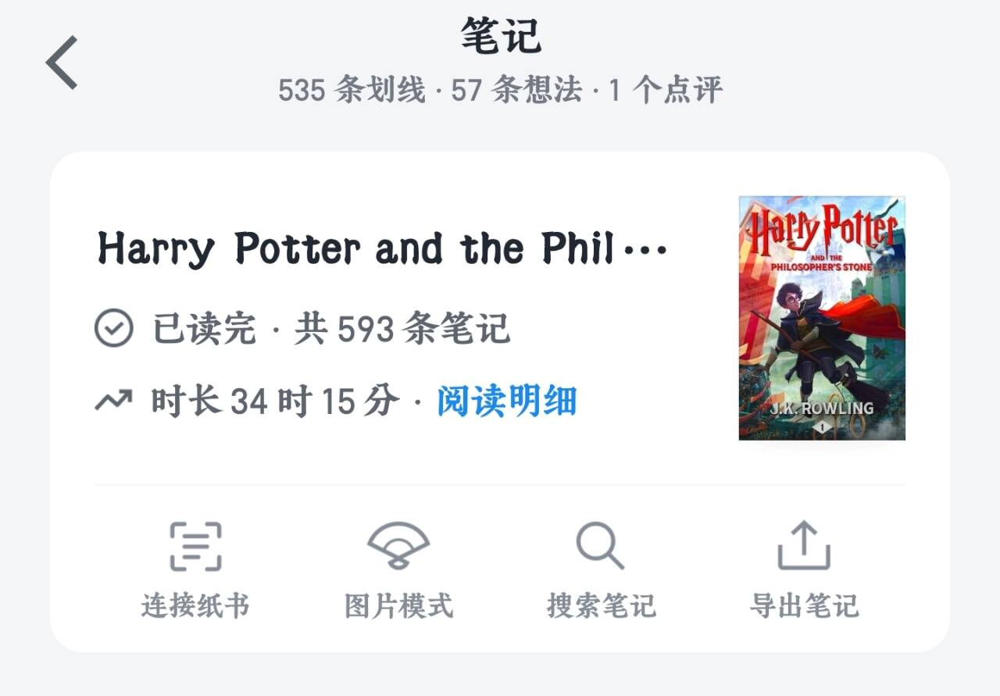

## 前言
>前言题外话，这两天经常在知乎刷到叶神的文章，尤其是下面这篇，非常有意思    
>[我爬取了 Thoughts Memo 和 Jarrett Ye 共 1903 篇回答 - 知乎](https://zhuanlan.zhihu.com/p/1981333174593294847)   

看完文章又激起我启用anki的计划，之前一直是三天打鱼两天晒网，没有坚持用，今天专门花时间好好搞一下。刚好，最近在看 _Harry Potter and prisoner of azkaban_，可以把前两部小说做的笔记都导出来，然后制作成anki卡组，用来复习遇到的生词。  

## 为什么用Anki
当你看完叶神的许多文章，答案就显而易见了。    
简而言之，间隔记忆是知识型学习最有效的学习方法，只要一点入门门槛，就可花最小的时间获得最大的收益。

## 一、导出笔记

导出你的读书或者学习笔记，txt文本、pdf之类的都可。   
这里我以微信读书为例，在「我」界面，点击笔记，然后点击进入某本书籍的笔记，如下图所示，然后点击导出笔记，直接复制到粘贴板。



## 二、使用大模型制作anki卡牌

现在市面上有很多用llm大模型制作卡牌的方法，不乏有结合mcp（一种大模型工具协议）自动生成牌组并自动导入的方法，但是这方法目前有点进阶了，对于不熟悉mcp的普通用户，可能不太好上手，啥时候会熟练试一下mcp可以进阶一下。但是为了满足当前需求，没必要花其他额外的时间折腾过多的工具，这样永无止境，未来慢慢折腾多了自然就上手了。    

真正要干活的时候，手头有啥先用啥，能解决问题就行，况且我这个简单的方法效果也还不错。

### 搞一套系统提示词
可以自己设计一套提示词，或者用我设计的，如下：   
```markdown
**指令:** 充当一位顶级的英语学习材料专家。你的任务是根据learner提供的任何文本/对话/内容（或先前的对话记录），为其创建一系列高质量、原子化的 Anki 抽认卡片（Flashcards），直接输出表格，表格格式充分检查要正确。

### 核心卡片生成原则:

注意：**内容分析与分解 (全面性优先):** * 仔细、完整地分析用户提供的输入内容，不能忽略文本内容，表格输出要丰富。* **全面、细致地分解输入内容中的 *所有* 信息**，确保不遗漏任何知识点。**内容要全面不能放过任何一个笔记内容点，不能放过任何一个单词或短语**，而不是只总结核心词，是每一个非初级词都要有。如果数量庞大不能单词输出，可以分批次输出。
1. **原子化知识（20 条规则）:** 严格遵守 SuperMemo 的“**制定知识的 20 条规则**”的精髓（如下所述），确保每张卡片只包含一个最小、最核心的知识点（即**原子化**）。
2. **全英环境（可理解性输入）:** 卡片的正面（Question/Problem）必须是**需要掌握的英文词汇、短语或句子**。卡片的背面（Answer/Solution）必须是使用**更简单、通俗易懂的英文短句**进行的解释或定义，避免使用中文，搭建纯粹的英语学习环境。而且英文解释要类似于vocabulary.com所用的那种解释，它更侧重于深度学习和全面理解词汇，而不是简单的记忆
3. 直接输出csv表格文件：

* `Front (English Question)`: 需要记忆的英文知识点。
* `Back (Simple English Explanation)`: 词性标注（如 [verb], [idiom], [adjective] 等） 移动到背面 (Back) 的最开头，然后还要加上对应单词的音标。简洁、通俗的类似于vocalbulary.com的英文解释。还要有一句包含该知识点例句类似于vocalbulary.com风格。
  
输出示例："sizzling","[adjective] /ˈsɪz.lɪŋ/<br><br> Making a hissing sound (like food frying).<br><br><i>The bacon was <b>sizzling</b> in the frying pan.</i>"

### SuperMemo 20 条规则的精髓（AI执行要点）:
* **简洁性:** 卡片内容必须尽可能短。
* **完整性:** 卡片内容必须易于理解，且上下文完整。
* **最小信息原则:** 绝不将多个知识点放在一张卡片上。
* **具体性:** 避免模糊或抽象的定义，使用具体、清晰的语言。

**现在，请根据我的下一个输入内容（例如：一篇英文文章、一段对话、一个单词列表等）生成符合上述要求的 Anki 卡片。**
```

然后在大模型端定制自己的卡牌制作助手，这里以gemni为例：  
点击 `New Gem` 新建一个Gem，然后将系统提示词复制进去，确认即可，然后就有了一个定制助手。


### 将笔记转为CSV表格

将导出的笔记发给聊天助手，即可，他会返回一个表格，或者csv文件代码。
- 如果是返回表格，可以直接点击导出，然后会进入google sheets页面，最后另存csv文件到本地即可。
- 如果直接给你csv代码，就新建文本文档，把代码复制进去，文件重命名为.csv格式就行。

>注：如果笔记数量多（比如我这500多条），可能不能一下子全部输出，需要几次轮询输出结果。

## 三、将CSV文件导入Anki

如图打开anki，点击导入文件，选择「逗号」为字段分隔符。  


删除重复：如果数量庞大，可能出现偶尔重复，可通过图示方法进行查找重复。    
「浏览」->「笔记」->「查找重复」  


然后就可以愉快的背单词了~


## （可选）美化样式
「**工具 (Tools)**」 ->「**管理笔记类型 (Manage Note Types)**」  -> 选择卡片类型通常是「**基础(basic)**」-> 然后点击右侧的「**卡片 (Cards)**」-> 「**样式 (Styling)**」    
复制一下 类vocabulary.com风格 css代码： 
```css
/* 全局背景：模仿 Vocabulary.com 的浅灰背景 */
.card {
    font-family: -apple-system, BlinkMacSystemFont, "Segoe UI", Roboto, Helvetica, Arial, sans-serif;
    font-size: 20px;
    text-align: center;
    color: #333;
    background-color: #f5f7fa; 
    margin: 0;
    height: 100vh; /* 充满屏幕高度 */
    display: flex;
    flex-direction: column;
    justify-content: center;
    align-items: center;
}

/* 白色卡片容器 */
.card-container {
    background-color: #ffffff;
    border-radius: 12px;
    box-shadow: 0 4px 15px rgba(0,0,0,0.08); /* 柔和阴影 */
    padding: 30px 20px;
    width: 90%;
    max-width: 500px; /* 限制最大宽度，电脑上看更舒服 */
    margin: auto;
    box-sizing: border-box;
}

/* 正面的大单词 */
.word {
    font-size: 2.2rem;
    font-weight: 800;
    color: #2c3e50;
    margin-bottom: 20px;
    line-height: 1.2;
}

/* 背面顶部的小单词（用于提示） */
.word-small {
    font-size: 1.2rem;
    font-weight: 700;
    color: #7f8c8d;
    margin-bottom: 10px;
}

/* 分割线 */
.separator {
    border: 0;
    height: 1px;
    background-image: linear-gradient(to right, rgba(0, 0, 0, 0), rgba(0, 0, 0, 0.1), rgba(0, 0, 0, 0));
    margin-bottom: 20px;
}

/* 提示文字 */
.hint {
    font-size: 0.9rem;
    color: #4CAF50; /* Vocabulary.com 绿 */
    font-weight: 600;
    text-transform: uppercase;
    letter-spacing: 1px;
    margin-top: 10px;
}

/* 解释部分的文字设置 */
.definition-container {
    text-align: left; /* 解释内容左对齐，更易阅读 */
    font-size: 1.05rem;
    line-height: 1.6;
    color: #444;
}

/* 专门针对例句的美化 (对应 CSV 中的 <i> 标签) */
i {
    display: block; /* 让例句独占一行 */
    font-style: normal; /* 取消斜体，更易读 */
    background-color: #f7fcf8; /* 极淡的绿色背景 */
    border-left: 4px solid #4CAF50; /* 左侧绿色竖线 */
    padding: 10px 15px;
    margin-top: 15px;
    color: #2c3e50;
    font-family: "Georgia", serif; /* 例句用衬线体，更有书卷气 */
    border-radius: 0 4px 4px 0;
}

/* 针对强调内容的美化 (对应 CSV 中的 <b> 标签) */
b {
    color: #2980b9; /* 蓝色强调核心词 */
    font-weight: 700;
}

/* 手机端适配：防止字太大 */
@media (max-width: 600px) {
    .word { font-size: 1.8rem; }
    .card-container { width: 95%; padding: 20px; }
}
```

